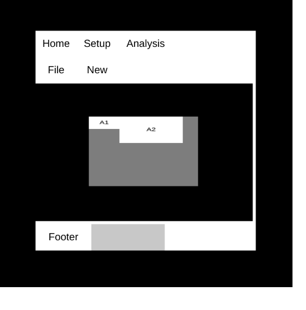

[Previous](#)
-----------------------

# UI Renderer Documentation




## Introduction

This library provides multiple independent files that can be used independently or with each other to achieve some useful task.

### Project Structure
```
- collide2D.js
- controls.js
- event.js
- renderer.js
- shape
    - rect.js
- ui
    - container_ui.js
    - global_ui_event.js
    - ui.js
```

#### I will be deeply greatful to know if you are interested in helping out to give a better shape to this project by either sharing about bugs and fixes or contributing by making more beautiful ui tools and utilities with the tools I have tried to provide with my ui system.

### Thankyou

-------------------------------------
[Next](./docs/introduction.md)
-------------------------------------

