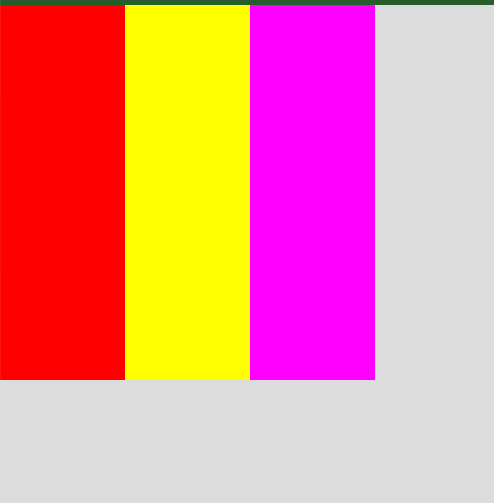
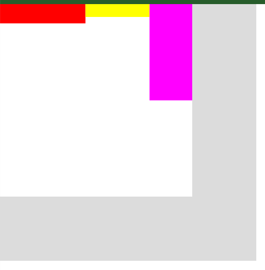
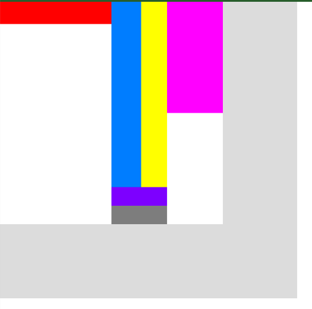
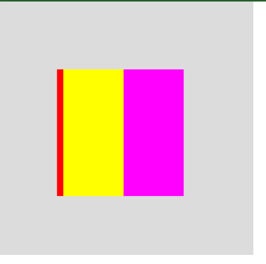
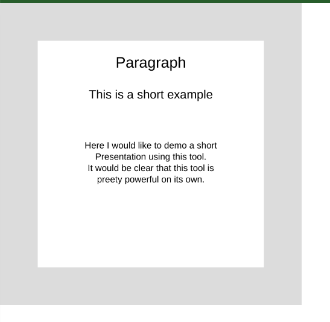

[Previous](./rect.md)
--------------------------------

## ContainerUi class

This class is at the heart of all ui that is made. It provides following functionality:

1) Each ui acts like a box layout.
2) Each ui child can be either fitted using weights or their constant size if they defined so.
3) Each ui child is a container_ui.
4) Each parent always provides the amount of space needed to all its children in case children have constant width or height, that means calculation of size starts from bottom(children) to top(parent).
5) If the parent is null then it is considered a window and only this container_ui is allowed to calculate the final state of all its children. Ultimately, this container_ui is only capable of having p5.Graphics object and this ui can only call the draw methods of all other children uis. There can be any number of these windows.

With enough examples, the mechanism of this class can be understood.Before that let me list out all the functions and variables available.

Note: This class is a very basic example of a layout system made using and rendered using Rect class, developers can make their own layout classes.

### Functions and Variables used

Note: # tagged functions and variables are for internal use only. 

Note: In any case, make sure to use provided functions to make changes to container_ui state rather than directly assigning values to variables.

#### Variables

The container_ui functions functions as either parent or child

#### Common Variables between parent and child
1) state = {}
    - it is a object or key-value pared variable that describes the original state of container_ui and is used to compute current state
    1) state.dir
        - can be "hortz" or "vert"
    2) state.name
        - name of the ui
    3) state.x,state.y,state.w,state.h
        - position and size
    4) state.fill_color
        - e.g. color(100)
    5) state.stroke_color
        - e.g. color(100)
    6) state.w_contant, state.h_constant
        - w_constant means width is constant
        - h_constant means height is constant
    7) state.w_weight, state.h_weight
        - w_weight means weight of width if w_constant is false
        - h_weight means height of width if h_constant is false
    6) state.w_per,state.h_per
        - w_per = width percent, h_per = height percent
    - note: if parent dir = "hortz" 
        - child w_constant = false and h_constant = false then w_weight is used and h_per is used
        - child w_constant = true and h_constant = false then state.w is used and h_per is used
        - child w_constant = false and h_constant = true then w_weight is used and state.h is used
        - child w_constant = true and h_constant = true then state.w is used and state.h is used
    - note if parent dir = "vert"
        - child w_constant = false and h_constant = false then w_per is used and h_weight is used
        - child w_constant = true and h_constant = false then state.w is used and h_weight is used
        - child w_constant = false and h_constant = true then w_per is used and state.h is used
        - child w_constant = true and h_constant = true then state.w is used and state.h is used
    
2) parent
    - if parent is null then it is considered a window
        - It is only allowed to call compute_box() method to compute the final state of all its children.
        - It is only allowed to have p5.Graphics and call draw on all its children.
    - If parent is not null then it is a children of another container_ui.
3) child = []
    - List of childrens
4) rounds = [top-left,top-right,bottom-right,bottom-left]
    - The roundness of every corner, e.g. [0,10,10,0]
5) show_text
    - if true shows text
6) text
    - contains text to be shown
7) text_wrap
    - can be CHAR or WORD
8) text_color
    - e.g. color(100)
9) text_align = [horizontal,vertical]
    - horizontal align can be LEFT,CENTER,RIGHT
    - vertical align can be TOP,CENTER,BOTTOM
    - e.g. [CENTER,CENTER]
10) text_style
    - can be NORMAL,BOLD, ITALIC or BOLDITALIC
11) text_leading
    - line height 17.5*(this.text_size/3) by default.
12) text_size
    - size of text
13) image
    - p5.Image
14) show_image
    - if true shows image instead of rectangle
15) disable_events
    - if true disables all its events
16) hover_event
    - contains function in the form ()=>{} or function()=>{}
17) hover_out_event
    - contains function in the form ()=>{} or function()=>{}
18) focus_event
    - contains function in the form ()=>{} or function()=>{}
19) focus_pressed_event
    - contains function in the form ()=>{} or function()=>{}
20) focus_out_event
    - contains function in the form ()=>{} or function()=>{}
21) focus_clicked_event
    - contains function in the form ()=>{} or function()=>{}

#### Variables exclusive to window

1) pg
    - p5.graphics
2) px,py
    - position of window with respect to canvas
3) disable_window_events
    - if false disables all window events

#### Functions
- constructor(dir,parent,name,lst)
    - for window keep parent = null and lst = [w,h]
    - every ui requires dir property
    - name is optional

1) set_disable_event(b)
2) set_disable_window_event(b) -- only for window container_ui
3) set_hover_event(f) -- function in the form ()=>{} or function()=>{}
4) set_hover_out_event(f) -- function in the form ()=>{} or function()=>{}
5) set_focus_event(f) -- function in the form ()=>{} or function()=>{}
6) set_focus_clicked_event(f) -- function in the form ()=>{} or function()=>{}
7) set_focus_pressed_event(f) -- function in the form ()=>{} or function()=>{}
8) set_focus_out_event(f) -- function in the form ()=>{} or function()=>{}
9) set_window_pos(x,y) -- only for window container_ui
10) set_pos(x,y)
11) set_rounds(b1,b2,b3,b4) - for all corners starring from topleft clockwise
12) set_size_const(w_constant,h_constant)
13) set_size_per(w_per,h_per)
14) set_size_weight(w_weight,h_weight)
15) set_size(w,h)
16) set_text(text)
17) set_direction(dir)
18) set_show_text(b)
19) set_image(image)
20) set_show_image(b)
21) set_fill_color(c)
22) set_stroke_color(c)
23) set_text_params(align,size,style,leading)
    - if leading  == -1 then by text_leading = 17.5*(this.text_size/3)
24) add_child(child,index)
    - child = child passed
    - index = position at which to insert child, can be null if you want to insert at the end
25) change_parent(parent)
    - helps if you want a drag and drop setup
16) remove()
    - removes a child from its parent and window, that means it is no longer drawn
    - it return parent
17) collidePoint(x,y)
    - return true if point is inside the ui
18) compute_horizontal_minimum(including_parent) -- #
    - for internal use only
19) compute_horizontal_maximum(including_parent) -- #
    - for internal use only
20) compute_vertical_minimum(including_parent) -- #
    - for internal use only
21) compute_vertical_maximum(including_parent) -- #
    - for internal use only
22) compute_box()
    - called only by window and should not be called by any other child exclusively by user
23) draw()
    - called only by window and should not be called on any child by user
24) draw_(pg,x,y,w,h) -- #
    - for internal use only

#### extra global variables
'1) global_parent_uis
    - contains only window container_ui
2) ui_rect
    - used by all container ui to draw it self

#### Notes
1) Window always has w_constant and h_constant equal to true
2) The priority of event as is considered is:
    1) hover_event
    2) hover_out_event
    3) focus_event
    4) focus_pressed_event
    5) focus_clicked
    6) focus_out_event
3) Return true says not to pass event to any upper class(parent uis).

### Examples


Note: In all examples the size of window is (300,300) and canvas size is (400,400), also


1) In this example ,every child has by default [w_constant,h_constant] = [false,false] meaning size is not constant , so every child after calling a.a.compute_box() on window we get a ui that has uniformly distributed child in it in horizontal direction.



```js

let a = {};

function setup() {
  createCanvas(400, 400);

  a.a = new ContainerUi("hortz",null,null,[300,300]);
  a.a.set_fill_color(color(255));

  a.a1 = new ContainerUi("hortz",a.a,"a1");
  a.a1.set_fill_color(color(255,0,0));

  a.a2 = new ContainerUi("vert",a.a,"a2");
  a.a2.set_fill_color(color(255,255,0));

  a.a3 = new ContainerUi("hortz",a.a,"a3");
  a.a3.set_fill_color(color(255,0,255));

  a.a.compute_box();

}

function draw() {
  background(220);
  a.a.draw();
}
```

2) In this example, 
    - chlid a1 has h_constant = true and h = 30, but w = 20 which is not considered since w_constant is still false
    - child a2 has both w_constant = true and h_constant = true , and size = (100,20), both sizes are considered
    - child a3 has both w_constant = false and h_constant = false, but h_per = 0.5, so since parent dir = "hortz", it considers its h_per to compute its height
    - note: a1 = red, a2 = yellow, a3 = pink



```js

let a = {};

function setup() {
  createCanvas(400, 400);

  a.a = new ContainerUi("hortz",null,null,[300,300]);
  a.a.set_fill_color(color(255));

  a.a1 = new ContainerUi("hortz",a.a,"a1");
  a.a1.set_size_weight(2);
  a.a1.set_size_const(false,true);
  a.a1.set_size(20,30);
  a.a1.set_fill_color(color(255,0,0));

  a.a2 = new ContainerUi("vert",a.a,"a2");
  a.a2.set_fill_color(color(255,255,0));
  a.a2.set_size_const(true,true);
  a.a2.set_size(100,20);

  a.a3 = new ContainerUi("hortz",a.a,"a3");
  a.a3.set_fill_color(color(255,0,255));
  a.a3.set_size_per(1,0.5);

  a.a.compute_box();


}

function draw() {
  background(220);
  a.a.draw();
}
```

3) In this example, a2 child has both w_constant and h_constant equal to false, while childs of a2 has
    - child a21 has w_constant = true and h_constant = false, w = 40, h_weight = 10, and all other extra parameters are ignored.
    - child a22 and a23 has h_weight = 1 by default
    - note: a2 = yellow, a21=light blue, a22=blue and a23=grey



```js

let a = {};

function setup() {
  createCanvas(400, 400);

  a.a = new ContainerUi("hortz",null,null,[300,300]);
  a.a.set_fill_color(color(255));

  a.a1 = new ContainerUi("hortz",a.a,"a1");
  a.a1.set_size_weight(2);
  a.a1.set_size_const(false,true);
  a.a1.set_size(20,30);
  a.a1.set_fill_color(color(255,0,0));
  a.a2 = new ContainerUi("vert",a.a,"a2");
  a.a2.set_fill_color(color(255,255,0));
  a.a3 = new ContainerUi("hortz",a.a,"a3");
  a.a3.set_fill_color(color(255,0,255));
  a.a3.set_size_per(1,0.5);

  a.a21 = new ContainerUi("hortz",a.a2,"a21");
  a.a21.set_size_weight(20,10);
  a.a21.set_size_const(true,false);
  a.a21.set_fill_color(color(0,125,255));
  a.a21.set_size(40,80);
  a.a22 = new ContainerUi("hortz",a.a2,"a22");
  a.a22.set_fill_color(color(125,0,255));
  a.a23 = new ContainerUi("hortz",a.a2,"a23");
  a.a23.set_fill_color(color(125));

  a.a.compute_box();

  console.log(a)

}

function draw() {
  background(220);
  a.a.draw();
}
```

4) In this example after clicking the following happens as shown in this image:
    - the window is moved using set_window_pos() and child a1's w_constant is set to true and also w = 10,



```js

let a = {};

function setup() {
  createCanvas(400, 400);

  a.a = new ContainerUi("hortz",null,null,[300,300]);
  a.a1 = new ContainerUi("hortz",a.a,"a1");
  a.a1.state.fill_color = color(255,0,0);
  a.a2 = new ContainerUi("vert",a.a,"a2");
  a.a2.state.fill_color = color(255,255,0);
  a.a3 = new ContainerUi("hortz",a.a,"a3");
  a.a3.state.fill_color = color(255,0,255);

  a.a21 = new ContainerUi("hortz",a.a2,"a21");
  a.a21.set_size_weight(20,10);
  a.a21.set_size_const(true,false);
  a.a22 = new ContainerUi("hortz",a.a2,"a22");
  a.a23 = new ContainerUi("hortz",a.a2,"a23");

  a.a.compute_box();

}

function draw() {
  background(220);
  a.a.draw();

  if(is_mouse_pressed){
    a.a.set_window_pos(mouseX,mouseY);
    a.a.set_size(200,200);
    a.a1.set_size_const(true,false);
    a.a1.set_size(10,100);
    a.a1.set_size_weight(4);
    a.a21.set_size(10,150);
    a.a.compute_box();
  }
}

```

5) This a short presentation demo



```js

let a = {};

function setup() {
  createCanvas(400, 400);

  a.a = new ContainerUi("vert",null,null,[300,300]);
  a.a.set_fill_color(color(255));
  a.a.set_window_pos(50,50);

  let texts = ["Paragraph","This is a short example", "Here I would like to demo a short\n Presentation using this tool.\n It would be clear that this tool is \npreety powerful on its own."];
  let text_sizes = [20,16,12];
  let text_heights = [40,40,110]

  for(let i=0 ; i<texts.length ; i++){
    a[`a${i}`] = new ContainerUi("hortz",a.a,`a${i}`);
    a[`a${i}`].set_text(texts[i]);
    a[`a${i}`].set_text_params([null,BOTTOM],text_sizes[i],WORD,null,null);
    a[`a${i}`].set_size_const(false,true);
    a[`a${i}`].set_size(null,text_heights[i]);
  }

  a.a.compute_box();

}

function draw() {
  background(220);
  a.a.draw();

}

```

---------------------------------------
[Next](./global_ui_event.md)
-----------------------------