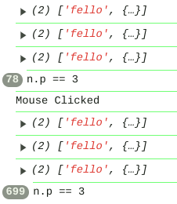
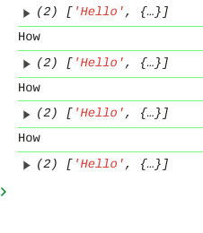

[Previous](./renderer.md)
--------------------------------

## event 
It provides two different classes **EVENT** and **Clock**


1) get_eventhandler returns the set_interval or set_timeout handler
2) clear_clock_event , clears the event name , its handler and its args

#### Event class
Event class is for internal use only, just Clock class is to be used. Still you can use its basic functionality.

#### Functions
1) constructor
    - no arguments
2) set_event(name, event, args) -- creates the event
    - name is in string
    - event is function passed in the form (args)=>{} or function(args){}
    - args is the argument passed
3) get_event(name) -- get event by name
    - name is in string
4) call_event(name) -- call event by name
    - name is in string
5) set_args(name,args) -- sets/changes the argument
    - name is the name of the event
    - args to change the arguments passed
6) clear_event(name) --  clears/deletes the given event 
    - name is in string


#### Examples

1) This examle will use Event class to create an event named "name" and on using even.call_event("name"), runs the provided functions.In this example ["gehh","gdge"] gets printed on every draw() call unless mouse_clicked occurs which clears tthe event
```js
let ev;

function setup() {
  createCanvas(400, 400);
  ev = new Event();
  ev.set_event("name",(args)=>{console.log(args)},["gehh","gdge"])
  
}

function draw() {
  background(220);
  if(is_mouse_clicked){
    ev.clear_event("name");
  }
  ev.call_event("name")
}

```

### Clock class extends Event class

So it have all the functionality of Event class with other functiionality.

#### Functions

1) constructor -- no argument
2) set_interval(name,event,interval,args) -- creates new clock event that gets triggered by every given interval until stopped
    - name is in string
    - event is function passed in the form (args)=>{} or function(args){}
    - interval is in miliseconds
    - args is the argument passed
3) set_timeout(name,event,timeout,args) -- creates new clock event that gets triggered after given timeout then stops and can be restarted
    - name is in string
    - event is function passed in the form (args)=>{} or function(args){}
    - timeout is in miliseconds
    - args is the argument passed
4) get_handler(name) -- gets event handler , note it is not tipocal event but a handler provided by javascript functions setInterval and setTimeout
    - name is a string
5) stop_event(name) -- stops the event and can be restarted
    - name is a string
6) reset_interval_event -- to change the duration/interval of a interval/timeout event
    - name is a string
    - duration is in float
7) clear_clock_event(name) -- note always clear a Interval or Timeout event with this function and not using clear_event function
    - name is a string

#### Examples
1) In this example, the setInterval gets called 3 times for 3 seconds unless n.p == 3 ,since in args[1] == n, and n.p++ is happening over and over when interval event is called. After that when mouse is clicked the above thing happens again



```js

let c;
let n;

function setup() {
  createCanvas(400, 400);
  c = new Clock();
  n = {p:0};
  c.set_interval("name",(args)=>{
    console.log(args);
    args[1].p++;
  },1000,["fello",n]);
}

function draw() {
  background(220);
  if(n.p == 3){
    console.log("Why")
    c.stop_event("name");
  }
  if(is_mouse_clicked){
    console.log("Mouse Clicked")
    n.p = 0;
    c.reset_interval_event("name",1000);
    
  }
}

```
Note: if you click mouse before n.p == 3 then n.p value gets changed on next call from 3 to 4 and thus event continues that means on every mouseClick you need to call as many stop_event to adjust the unwanted side effect.

2) In this example a timeout event is called and recalled evey time mouse is clicked


```js

let c;
let n;

function setup() {
  createCanvas(400, 400);
  c = new Clock();
  n = {p:0};
  c.set_timeout("name",(args)=>{
    console.log(args);
    args[1].p++;
  },1000,["Hello",n]);
}

function draw() {
  background(220);
  if(is_mouse_clicked){
    console.log("Mouse Clicked")
    n.p = 0;
    c.reset_timeout_event("name",1000);
  }
}


```


---------------------------------------
[Next](./rect.md)
-----------------------------