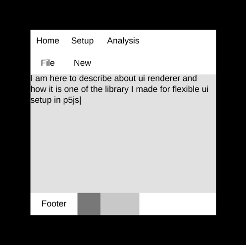
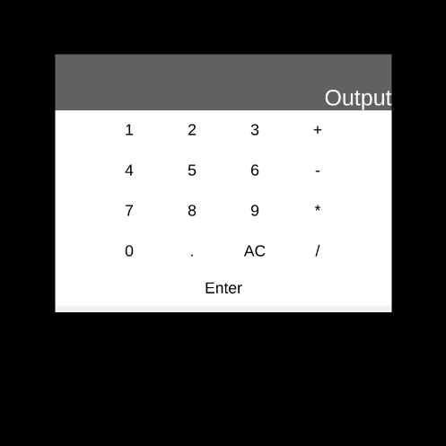
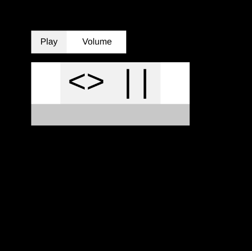
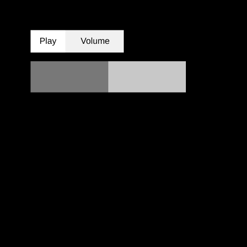
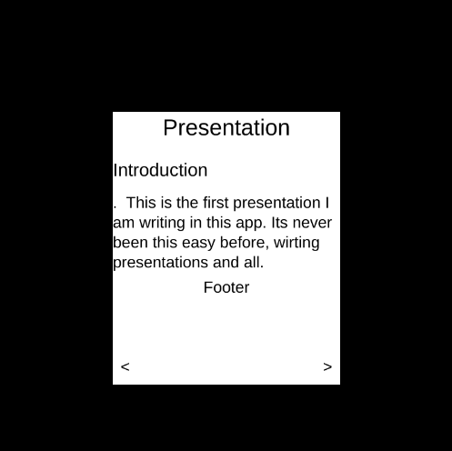
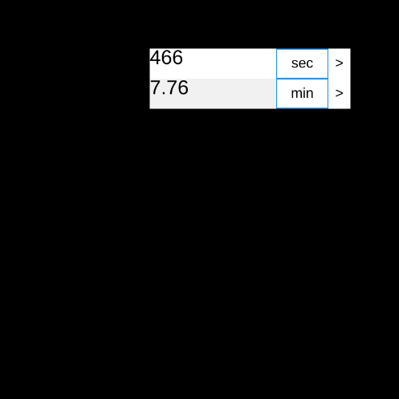

[Previous](./ui.md)
--------------------------------

## Table

1) [text_editor](#text_editor)
2) [calculator](#calculator)
3) [music_player](#music_player)
4) [converter](#converter)
5) [music_player](#music_player)
6) [presentation](#presentation)


### text_editor

```js

// text editor interface
let a = {};
let path = "./docs/media/images/ui_2.png";

function setup(){
  createCanvas(400,400);
  frameRate(120);


  // let p = loadImage(path);

  a.a = new ContainerUi("hortz",null,"parent",[300,300]);
  // a.a.state.fill_color = color(255);
  a.a.set_window_pos(50,50);
  a.a.state.fill_color = color(225);

  a.a1 = new GridUi(a.a,"grid",4);
  a.a1.set_row_constant(0,false);
  a.a1.set_row_constant(1,false);
  a.a1.set_row_constant(3,false);
  a.a1.make_row_expanded(2);

  a.Home = new BoxUi(a.a1.get_row(0),"Home");
  a.Home.set_text("Home");
  a.Home.body.set_focus_clicked_event(()=>{
    console.log("Gekki")
  });
  a.Setup = new BoxUi(a.a1.get_row(0),"Setup");
  a.Setup.set_text("Setup");
  a.Analysis = new BoxUi(a.a1.get_row(0),"Analysis",60);
  a.Analysis.set_text("Analysis");
  a.s1 = new ExpandedUi(a.a1.get_row(0),"s1");

  a.File = new BoxUi(a.a1.get_row(1),"File");
  a.File.set_text("File");
  a.New = new BoxUi(a.a1.get_row(1),"New");
  a.New.set_text("New");
  a.s2 = new ExpandedUi(a.a1.get_row(1),"s2");

  //  testing to see if removing works as expected
  // a.File.remove(); 
  // a.a1.add_child(1,a.File.bg,1);

  a.TextArea = new ExpandedUi(a.a1.get_row(2),"TextArea");
  a.TextArea.element.state.fill_color = color(225);
  a.TextArea.element.set_text_params([LEFT,TOP],null,WORD);
  a.TextArea.element.set_text("|");
  let b1 = false;
  key_released_events.push(()=>{
    if(!b1) return;
    let p1 = current_key_released;
    a.TextArea.element.set_text(utility_text(p1,a.TextArea.element.text));
  })
  a.TextArea.element.set_focus_event(()=>{
    b1  = true;
  })
  a.TextArea.element.set_focus_out_event(()=>{
    b1 = false;
  })


  a.Footer = new BoxUi(a.a1.get_row(3),"Footer",60);
  a.Footer.set_text("Footer");
  a.slider = new SliderUi(a.a1.get_row(3),"Slider","hortz",100,20);
  a.s3 = new ExpandedUi(a.a1.get_row(3),"s3");
  a.a.compute_box();
  a.slider.slider.set_size(a.slider.slider.w,a.slider.parent.h);
  a.a.compute_box();


  // assert(a);
}

function draw(){
  background(0);
  a.a.draw();

  // console.log(current_key_pressed,keyp,is_key_released);

}

```

### calculator

```js
// Calculator interface
let a = {};

let output = "";

function setup(){
  createCanvas(400,400);

  a.a = new ContainerUi("hortz",null,"parent",[300,230])
  a.a.set_window_pos(50,50);
  a.a.set_fill_color(utility_colors.light_gray);

  a.a1 = new GridUi(a.a,"grid",6);

  // in row 0
  a.a1.set_row_constant(0,false);

  a.output = new ExpandedUi(a.a1.get_row(0),"output");
  a.output.element.set_size_const(false, true);
  a.output.element.set_size(30,50);
  a.output.element.set_text("Output");
  a.output.element.set_text_params([RIGHT,BOTTOM],20,WORD,);
  a.output.element.set_fill_color(utility_colors.dark_gray);
  a.output.element.set_text_color(color(255));

  // for row 1
  a.a1.set_row_constant(1,false);
  
  {
    let temp = new ExpandedUi(a.a1.get_row(1),"");
  }
  
  for(let i=1 ; i<=3 ; i++){
    let t = i + " ";
    let temp = new BoxUi(a.a1.get_row(1),t);
    temp.set_text(t);
    temp.body.set_focus_clicked_event(()=>{
      output += t;
      a.output.element.set_text(output);
    });
  }
  
  {
    let temp = new BoxUi(a.a1.get_row(1),"+");
    temp.set_text("+");
    temp.body.set_focus_clicked_event(()=>{
      output += "+ ";
      a.output.element.set_text(output);
    });
  }
  
  {
    let temp = new ExpandedUi(a.a1.get_row(1),"");
  }

  // for row 2
  a.a1.set_row_constant(2,false);
  
  {
    let temp = new ExpandedUi(a.a1.get_row(2),"");
  }
  
  for(let i=4 ; i<=6 ; i++){
    let t = i + " ";
    let temp = new BoxUi(a.a1.get_row(2),t);
    temp.set_text(t);
    temp.body.set_focus_clicked_event(()=>{
      output += t;
      a.output.element.set_text(output);
    });
  }
  
  {
    let temp = new BoxUi(a.a1.get_row(2),"-");
    temp.set_text("-");
    temp.body.set_focus_clicked_event(()=>{
      output += "- ";
      a.output.element.set_text(output);
    });
  }
  
  {
    let temp = new ExpandedUi(a.a1.get_row(2),"");
  }
  
  
// for row 3
  a.a1.set_row_constant(3,false);
  
  {
    let temp = new ExpandedUi(a.a1.get_row(3),"");
  }
  
  for(let i=7 ; i<=9 ; i++){
    let t = i + " ";
    let temp = new BoxUi(a.a1.get_row(3),t);
    temp.set_text(t);
    temp.body.set_focus_clicked_event(()=>{
      output += t;
      a.output.element.set_text(output);
    });
  }
  
  {
    let temp = new BoxUi(a.a1.get_row(3),"X");
    temp.set_text("*");
    temp.body.set_focus_clicked_event(()=>{
      output += "* ";
      a.output.element.set_text(output);
    });
  }
  
  {
    let temp = new ExpandedUi(a.a1.get_row(3),"");
  }  
  
// for row 4
  a.a1.set_row_constant(4,false);
  
  {
    let temp = new ExpandedUi(a.a1.get_row(4),"");
  }
  
  for(let i=0 ; i<3 ; i++){
    let t = ["0 ",". ","AC"][i];
    let temp = new BoxUi(a.a1.get_row(4),t);
    temp.set_text(t);
    if(t != "AC")
      temp.body.set_focus_clicked_event(()=>{
        output += t;
        a.output.element.set_text(output);
      });
    else 
      temp.body.set_focus_clicked_event(()=>{
        output = "";
        a.output.element.set_text(output);
      });
  }
  
  {
    let temp = new BoxUi(a.a1.get_row(4),"/");
    temp.set_text("/");
    temp.body.set_focus_clicked_event(()=>{
      output += "/ ";
      a.output.element.set_text(output);
    });
  }
  
  {
    let temp = new ExpandedUi(a.a1.get_row(4),"");
  }  

// for row 5
  a.a1.set_row_constant(5,false);
  a.enter = new ExpandedUi(a.a1.get_row(5),"enter");
  a.enter.element.set_size_const(false, true);
  a.enter.element.set_size(30,30);
  a.enter.element.set_text("Enter");
  a.enter.element.set_focus_clicked_event(()=>{
    try{
      output = eval(output.replace(/\s+/g, ''));
    }catch{}
    a.output.element.set_text(output);
  })
  
  
  a.a.compute_box();

}

function draw(){
 background(0);
 a.a.draw();

}
```

### music_player


```js
// music player interface
let a = {};
let play_song;
let clock;


function setup(){
  createCanvas(400,400);
  clock  = new Clock();
  play_song = clock.set_interval("playing",(args)=>{
    // console.log(a.slider_ui.amt);
    a.slider_ui.amt += 0.1;
    if(a.slider_ui.amt > 1){
      a.slider_ui.amt = 0;
    }
    a.slider_ui.slider_per.set_size_per(a.slider_ui.amt,a.slider_ui.amt);
    a.b.compute_box();
  },1000);
  clock.stop_event("playing");

  // tabs 
  a.a = new ContainerUi("hortz",null,"parent",[150,36]);
  a.a.set_window_pos(50,50);
  a.a.set_fill_color(color(125));
  
  a.play = new BoxUi(a.a,"Play");
  a.play.set_text("Play");
  a.play.set_fg_color(utility_colors.light_gray);
  a.play.set_bg_color(utility_colors.light_gray);
  a.play.bg.set_focus_clicked_event(()=>{
    a.play.set_fg_color(utility_colors.light_gray);
    a.play.set_bg_color(utility_colors.light_gray);
    a.volume.set_fg_color(color(255));
    a.volume.set_bg_color(color(255));
    a.b.set_disable_window_event(false);
    a.c.set_disable_window_event(true);
  })
  
  a.volume = new BoxUi(a.a,"Volume",80);
  a.volume.set_text("Volume");
  a.volume.bg.set_focus_clicked_event(()=>{
    a.volume.set_fg_color(utility_colors.light_gray);
    a.volume.set_bg_color(utility_colors.light_gray);
    a.play.set_fg_color(color(255));
    a.play.set_bg_color(color(255));
    a.c.set_disable_window_event(false);
    a.b.set_disable_window_event(true);
  })
  
  
  // body of music player
  a.b = new ContainerUi("hortz",null,"parent",[250,100]);
  a.b.set_window_pos(50,100);
  a.b.set_fill_color(color(255));
  
  a.b_grid = new GridUi(a.b,"grid_b",2);
  
  // in row 0
  a.b_grid.set_row_constant(0,false);
  {
    new ExpandedUi(a.b_grid.get_row(0));
  }
  
  a.play_button = new BoxUi(a.b_grid.get_row(0),"play_button",66,50);
  a.play_button.body.set_text_params(null,50);
  a.play_button.set_text("<>");
  a.play_button.set_fg_color(utility_colors.light_gray);
  a.play_button.set_bg_color(utility_colors.light_gray);
  
  a.play_button.body.set_focus_clicked_event(()=>{
    clock.reset_interval_event("playing",1000);
    // console.log("Helli")
  });
  
  
  
  a.pause_button = new BoxUi(a.b_grid.get_row(0),"pause_button",60,50);
  a.pause_button.body.set_text_params(null,50);
  a.pause_button.set_text("| |");
  a.pause_button.set_fg_color(utility_colors.light_gray);
  a.pause_button.set_bg_color(utility_colors.light_gray);
  a.pause_button.body.set_focus_clicked_event(()=>{
    clock.stop_event("playing");
    // console.log("Helli")
  });
  
  {
    new ExpandedUi(a.b_grid.get_row(0));
  }
  
  // in row 2
  a.slider_ui = new SliderUi(a.b_grid.get_row(1),"time");
  a.slider_ui.slider.set_size(250);
  
  // body of volume
  a.c = new ContainerUi("hortz",null,"parent",[250,50]);
  a.c.set_window_pos(50,100);
  a.c.set_fill_color(color(255));
  
  // in row 0
  a.vol = new SliderUi(a.c,"volume_slider");
  a.vol.slider.set_size(250);
  a.vol.slider_per.set_size_per(0.5,0.5);

  
  a.a.compute_box();
  a.b.compute_box();
  a.c.compute_box();
  a.c.set_disable_window_event(true);
  // console.log(global_parent_uis)

}

function draw(){
  background(0);
  a.a.draw();
  if(!a.b.disable_window_events)
    a.b.draw();
  if(!a.c.disable_window_events)
    a.c.draw();
  
  // a.c.draw();

}
```

### presentation

```js
// Presentation ui
let a = {};

let pages = [
  ["Presentation",30,"Introduction",30,".  This is the first presentation I am writing in this app. Its never been this easy before, wirting presentations and all.",80,"Footer",30],
  
  ["Presentation",30,"Preface",30,".  Let me tell You a secrete about this presentation.",40,"Footer",30],
  
  ["Presentation",30,"Chapter 1",30,".  This chapter presents the basic concept of how to get with the problem of doing comedy once and twice and thrice a week and the againg not doing it for quite a while.",120,"Footer",30]
];

let current_page = 0;

function set_presentation(h1,s1,h2,s2,h3,s3,h4,s4){
  // in row 0
  a.a1.set_row_constant(0,false);
  a.a1.get_row(0).set_size(null,s1);
  a.a1.get_row(0).set_text_params(null,20);
  a.a1.get_row(0).set_text(h1);
  
  // in row 1
  a.a1.set_row_constant(1,false);
  a.a1.get_row(1).set_size(null,s2);
  a.a1.get_row(1).set_text_params([LEFT,BOTTOM],16);
  a.a1.get_row(1).set_text(h2);
  
  
  // in row 2
  a.a1.set_row_constant(2,false);
  a.a1.get_row(2).set_size(null,s3);
  a.a1.get_row(2).set_text_params([LEFT,BOTTOM],14,WORD);
  a.a1.get_row(2).set_text(h3);
  
  // in row 3
  
  a.a1.set_row_constant(3,false);
  a.a1.get_row(3).set_size(null,s4);
  a.a1.get_row(3).set_text_params(null,14,WORD);
  a.a1.get_row(3).set_text(h4);
  
}

function setup(){
  createCanvas(400,400);

  a.a = new ContainerUi("hortz",null,"parent",[200,240])
  a.a.set_window_pos(100,100);
  a.a.set_fill_color(color(255));
  

  a.a1 = new GridUi(a.a,"grid",6);
  
  set_presentation(...pages[current_page]);
  
  // in row 4
  a.a1.make_row_expanded(4);
  
  // in row 5
  a.a1.set_row_constant(5,false);
  {
    let temp = new BoxUi(a.a1.get_row(5),"left",20,28);
    temp.set_margin(1,1,1,1);
    temp.set_text("<");
    temp.body.set_hover_event(()=>{
      temp.set_fg_color(utility_colors.light_gray);
    });
    temp.body.set_hover_out_event(()=>{
      temp.set_fg_color(color(255));
    });
    temp.body.set_focus_clicked_event(()=>{
      if(current_page > 0){
        current_page--;
        set_presentation(...pages[current_page]);
        a.a.compute_box();
      }
    });
  }
  
  {
    let temp = new ExpandedUi(a.a1.get_row(5),"");
  }
  
  {
    let temp = new BoxUi(a.a1.get_row(5),"right",20,28);
    temp.set_margin(1,1,1,1);
    temp.set_text(">");
    temp.body.set_hover_event(()=>{
      temp.set_fg_color(utility_colors.light_gray);
    });
    temp.body.set_hover_out_event(()=>{
      temp.set_fg_color(color(255));
    });
    temp.body.set_focus_clicked_event(()=>{
      if(current_page < pages.length - 1){
        current_page++;
        set_presentation(...pages[current_page]);
        a.a.compute_box();
      }
    });
  }

  a.a.compute_box();

  
  // console.log(a.a1.get_row(0))
}

function draw(){
 background(0);
 a.a.draw();

}
```

### converter

```js
// Converter interface

let a = {};
let units = ["sec","min","hrs"];

function convert(num_str,t1,t2){
  let temp = parseFloat(num_str);
  if(t1 == "sec" && t2 == "min"){
    temp = temp / 60;
    return temp + "";
  }else if(t1 == "sec" && t2 == "hrs"){
    temp = temp / 3600;
    return temp + "";
  }else if(t1 == "min" && t2 == "sec"){
    temp = temp * 60;
    return temp + "";
  }else if(t1 == "min" && t2 == "hrs"){
    temp = temp / 60;
    return temp + "";
  }else if(t1 == "hrs" && t2 == "sec"){
    temp = temp * 3600;
    return temp + "";
  }else if(t1 == "hrs" && t2 == "min"){
    temp = temp * 60;
    return temp + "";
  }else return num_str;
}

function setup(){
  createCanvas(400,400);

  a.a = new ContainerUi("hortz",null,"parent",[200,60])
  a.a.set_window_pos(150,50);
  a.a.set_fill_color(utility_colors.orange);

  a.a1 = new GridUi(a.a,"grid",3);

  // in row 0
  a.a1.set_row_constant(0,false);
  
  a.box_1 = new ExpandedUi(a.a1.get_row(0),"box_1");
  a.box_1.element.set_size_const(false, true);
  a.box_1.element.set_size(30,30);
  a.box_1.element.set_text_color(color(0));
  a.box_1.element.set_text_params([LEFT,TOP],20,WORD);
  a.box_1.element.set_text("");
  let b1 = false;
  key_released_events.push(()=>{
    if(!b1) return;
    let p1 = current_key_released;
    if(p1 >= '0' && p1 <= '9' || p1 == '.'){
      a.box_1.element.set_text(a.box_1.element.text+p1);
    }else if(p1 == "BACKSPACE"){
      a.box_1.element.set_text(a.box_1.element.text.slice(0,-1));
    }else if(p1 == "ENTER"){
      a.box_2.element.set_text(convert(a.box_1.element.text,a.t1.body.text,a.t2.body.text));
    }
  })
  a.box_1.element.set_focus_event(()=>{
    b1  = true;
    a.box_1.element.set_fill_color(utility_colors.light_gray);
  })
  a.box_1.element.set_focus_out_event(()=>{
    b1 = false;
    a.box_1.element.set_fill_color(color(255));
  })


  a.t1 = new BoxUi(a.a1.get_row(0),"first",50,28);
  a.t1.set_text("sec");
  a.t1.set_margin(1,1,1,1);
  a.t1.set_bg_color(utility_colors.blue);
  
  {
    let temp = new BoxUi(a.a1.get_row(0),"",20,28);
    temp.set_margin(1,1,1,1);
    temp.set_text(">");
    temp.body.set_focus_clicked_event(()=>{
      for(let i=0 ; i<units.length ; i++){
        if(a.t1.body.text == units[i]){
          a.t1.set_text(units[(i+1)%3]);
          break;
        }
      }
    });
  }

  
  
// for row 2
  
  a.a1.set_row_constant(2,false);
  
  a.box_2 = new ExpandedUi(a.a1.get_row(2),"box_1");
  a.box_2.element.set_size_const(false, true);
  a.box_2.element.set_size(30,30);
  a.box_2.element.set_text_color(color(0));
  a.box_2.element.set_text_params([LEFT,TOP],20,WORD);
  a.box_2.element.set_text("");
  let b2 = false;
  key_released_events.push(()=>{
    if(!b2) return;
    let p1 = current_key_released;
    if(p1 >= '0' && p1 <= '9' || p1 == '.'){
      a.box_2.element.set_text(a.box_2.element.text+p1);
    }else if(p1 == "BACKSPACE"){
      a.box_2.element.set_text(a.box_2.element.text.slice(0,-1));
    }else if(p1 == "ENTER"){
      a.box_1.element.set_text(convert(a.box_2.element.text,a.t2.body.text,a.t1.body.text));
    }
  })
  a.box_2.element.set_focus_event(()=>{
    b2  = true;
    a.box_2.element.set_fill_color(utility_colors.light_gray);
  })
  a.box_2.element.set_focus_out_event(()=>{
    b2 = false;
    a.box_2.element.set_fill_color(color(255));
  })


  a.t2 = new BoxUi(a.a1.get_row(2),"first",50,28);
  a.t2.set_text("min");
  a.t2.set_margin(1,1,1,1);
  a.t2.set_bg_color(utility_colors.blue);
  
  {
    let temp = new BoxUi(a.a1.get_row(2),"",20,28);
    temp.set_margin(1,1,1,1);
    temp.set_text(">");
    temp.body.set_focus_clicked_event(()=>{
      for(let i=0 ; i<units.length ; i++){
        if(a.t2.body.text == units[i]){
          a.t2.set_text(units[(i+1)%3]);
          break;
        }
      }
    });
  }

  
  a.a.compute_box();

}

function draw(){
 background(0);
 a.a.draw();

}
```

---------------------------------------
[Next](#)
-----------------------------