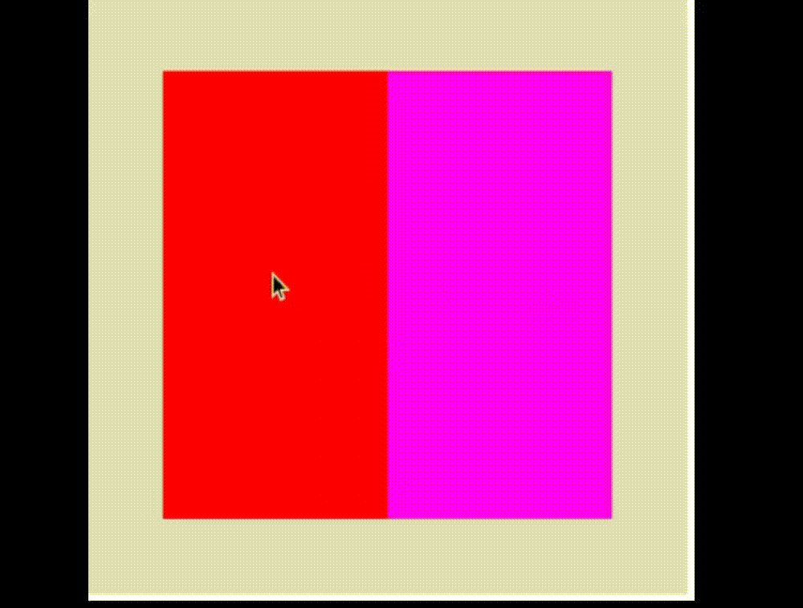
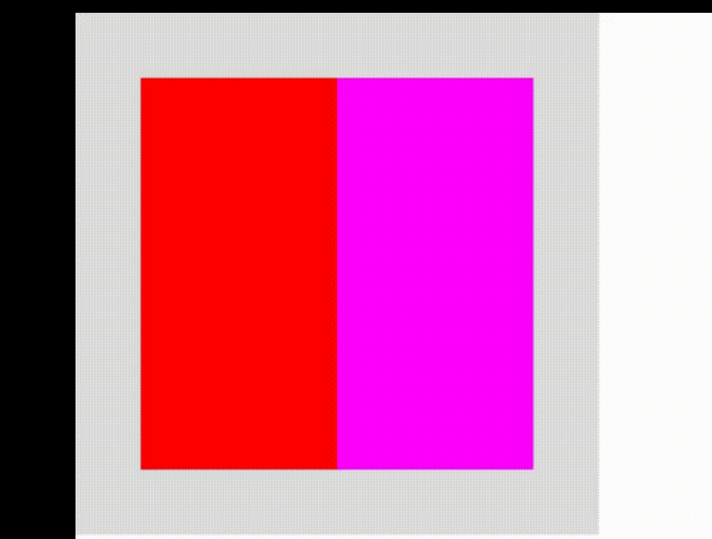

[Previous](./container_ui.md)
--------------------------------

## Global Evevt for Ui

Note: All the variables and functions are for internal use only.

### Functions and Variables

### Variables

1) focused = []
2) focus_pressed = []
3) focus_clicked = []
4) hovered = []
5) previous_hover = []
6) mouse_pressed_during_focus_pressed -- boolean

### Functions

1) compute_hover()
2) compute_focus()
3) compute_hover_event()
4) compute_focus_event()
5) compute_hover_out_event()
6) compute_focus_pressed_event()
7) compute_focus_out_event()
8) compute_focus_clicked_event()
9) ui_event_loop()


### Notes:
1) The priority of event as is considered is:
    1) hover_event
    2) hover_out_event
    3) focus_event
    4) focus_pressed_event
    5) focus_clicked
    6) focus_out_event
2) Return true says not to pass event to any upper class(parent uis).

### Examples

1) In this example, child has following events:
    - child a1 and a2 both has 
        - focus_pressed_event which remains active up util you stop clicking, 
        - focus_clicked_event which activated only once after you click is registered
        - focus_out_event which is activated after the mouse is clicked and focus is changed to other ui



```js

let a = {};

function setup() {
  createCanvas(400, 400);

  a.a = new ContainerUi("hortz",null,null,[300,300]);
  a.a.set_window_pos(50,50);

  a.a1 = new ContainerUi("hortz",a.a,"a1");
  a.a1.set_fill_color(color(255,0,0));
  a.a1.set_focus_pressed_event(()=>{
    a.a1.set_text("focuse_pressed");
    return true;
  });
  a.a1.set_focus_clicked_event(()=>{
    a.a1.set_text("focuse_clicked");
    return true;
  });
  a.a1.set_focus_out_event(()=>{
    a.a1.set_text("focuse_out");
    return true;
  });
  

  a.a2 = new ContainerUi("vert",a.a,"a2");
  a.a2.set_fill_color(color(255,0,255));
  a.a2.set_focus_pressed_event(()=>{
    a.a2.set_text("focuse_pressed");
    return true;
  });
  a.a2.set_focus_clicked_event(()=>{
    a.a2.set_text("focuse_clicked");
    return true;
  });
  a.a2.set_focus_out_event(()=>{
    a.a2.set_text("focuse_out");
    return true;
  });


  a.a.compute_box();
}

function draw(){
    background(220);
    a.a.draw();
}

```

2) It is an example of making a tooltip using a window and disabling its events.



```js

let a = {};

function setup() {
  createCanvas(400, 400);

  a.a = new ContainerUi("hortz",null,"a",[300,300]);
  a.b = new ContainerUi("hortz",null,"b",[100,30]);
  a.b.set_fill_color(color(255));
  a.b.set_disable_event(true);
    a.a.set_window_pos(50,50);
  a.a1 = new ContainerUi("hortz",a.a,"a1");
  a.a1.set_fill_color(color(255,0,0));
  a.a1.set_hover_event(()=>{
    a.b.set_text("Its a.a1 here.");
    a.b.set_window_pos(clientX,clientY);
    a.b.draw();
    return true;
  })
  a.a2 = new ContainerUi("vert",a.a,"a2");
  a.a2.set_fill_color(color(255,0,255));
  a.a2.set_hover_event(()=>{
    a.b.set_text("Its a.a2 here.");
    a.b.set_window_pos(clientX,clientY);
    a.b.draw();
    return true;
  })
  a.a.compute_box();

}

function draw(){
    background(220);
    a.a.draw();
}

```


---------------------------------------
[Next](./ui.md)
-----------------------------