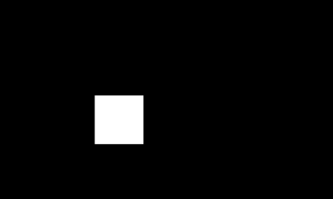

[Previous](./controls.md)
--------------------------------
## Renderer 

This file is specifically made to declare foundation of all the other js files I created. It declares framework for 2 different concepts, that is what a **shape** is and how it should be **rendered** through:

1) Shape class
2) renderer function

### Shape class

#### parameters
1) name -> name of the shape, e.g. rect
2) lst  -> list of points you need to give the shape

#### auto used or called functions
Thes are the functions that will be used while using renderer.

1) shape+"_box"
    - e.g., rect_box, it is used to define the bounded rect that can cover whole shape
2) shape+"_polygon"
    - e.g., rect_polygon, it is used to return the actual polygon points

3) shape+"_renderer"
    -e.g. rect_renderer, it is used to define how your shape is actuall going to draw on the screen, note it doesnot always requires a parameter names graphics 


### Example

```js

class Rect extends Shape{
  
  constructor(lst){
    super("rect",lst);
    this.rect_box();
  }
  
  rect_box(){
    this.bounds = [...this.list];
  }
  
  rect_polygon(){
    return [...this.bounds];
  }
  
  rect_renderer(graphics){
    graphics.rect(...this.list);
  }
  
  
}
```

### Renderer function

#### parameters

1) graphics
    - the pGraphics to be used
2) shape
    - the shape to be drawn
3) x,y,w,h 
    - defines the bound of image

#### Steps renderer function uses to draw the shape on screen

1) First it checks if the shape is on the screen or not by checking its bounds with screens bound, e.g. collidePointRect(x1,y1,  0,0,width,height) for left moset (x1,y1) bound point of shape
2) If yes, then it calls shape+"_renderer" function passing the parameters **graphics** and **shape**, otherwise returns
3) Then draws the image on the screen with the bounds provided (x,y,w,h), note if (w,h) is not provided then pGraphics is not resized, and if (x,y,w,h) is not provided the image is drawn at (0,0) with unresized pGraphics

#### Example

1) Example 1


```js
let pg, r;

function setup(){
    createCanvas(400,400);

    pg = createGraphics(200,200);
    r = new Rect([0,0,100,100]);
}

function draw(){
    background(0);
    renderer(pg,r,100,100,100,100); // (gr,shape,x,y,w,h)
}
```


---------------------------------------
[Next](./event.md)
-----------------------------