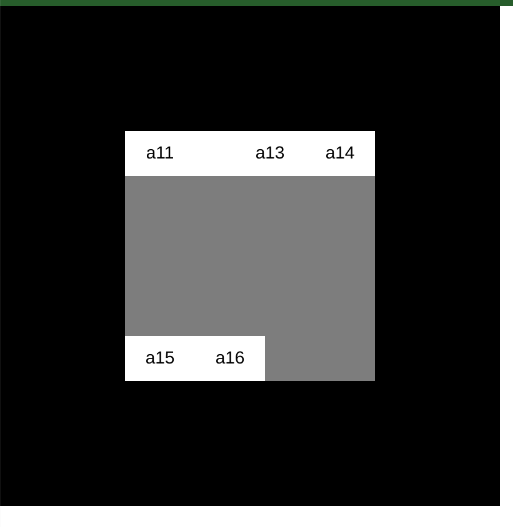

[Previous](./global_ui_event.md)
--------------------------------

## Ui file
 It contains four ui classes at this point of time:

 1) BoxUi
 2) ExpandedUi
 3) GridUi
 4) SliderUi


### BoxUi
It features fixed width and height with margin, background and foreground color.

#### Note: Functions and Variable used with # is used internally and shhoud not be explicitly used by users


#### Variables

Normal variables:

1) name
2) bg_color
3) fg_color
4) no_color
5) margin = {t,b,l,r}, by default {t:8,b:8,l:8,r:8}
6) size = {w,h} , by default {w:40,h:20}
7) bg_rounds = [], by default [0,0,0,0]
8) fg_rounds = [], by default [0,0,0,0]

note: margin is added on top of width and height so to adjust total size you can either resize the ui by set_size(c.size.w-c.margin.l-margin.r,c.size.h-c.margin.t-margin.b)

container_ui variables:

0) Constructor(parent,name,width,height) -- note width and height are optional
1) parent
2) bg  --  only child of parent, then all other are its child
    - hortz
    - contains margin_left, margin_right, body_bg
3) margin_top
4) margin_right
5) margin_bottom
6) margin_left
7) body_bg -- vert -- contains margin_top, margin_bottom and body
8) body


Note: By default all container_ui except parent has both w_constant and h_constant = true

#### Function

1) change_parent(parent,index)
2) remove() -- returns parent
3) update_size() -- # , used internally
4) set_margin(t,r,b,l) -- trbl = top,right,bottom,left values
5) set_size(w,h)
6) set_text(text)
7) set_bg_color(color)
8) set_fg_color(color)

#### Example of BoxUi

1) 


```js

let a = {};

function setup(){
  createCanvas(400,400);

  a.a = new ContainerUi("hortz",null,"parent",[200,200])
  a.a.set_window_pos(100,100);
  a.a.set_fill_color(color(125));

  a.a1 = new ContainerUi("hortz",a.a,"a1");

  a.a11 = new BoxUi(a.a1,"a11");
  a.a11.set_text("A1");


  a.a12 = new BoxUi(a.a1,"a12",100,60);
  a.a12.set_text("A2");

  a.a.compute_box();

}

function draw(){
  background(0);
  a.a.draw();

}

```

### ExpandedUi class
It expands in all direction.

#### Note: Functions and Variable used with # is used internally and shhoud not be explicitly used by users


#### Variables

Normal variables:

1) name

container_ui variables:

1) parent
2) element -- by default w_constant and h_constant are false,  
    - only child of parent


#### Functions

0) constructor(parent,name,direction)
1) change_parent(parent,index)
2) remove()-- returns parent

#### Examples

1) 


```js

let a = {};

function setup(){
  createCanvas(400,400);

  a.a = new ContainerUi("hortz",null,"parent",[200,200])
  a.a.set_window_pos(100,100);
  a.a.set_fill_color(color(125));

  a.a1 = new ContainerUi("hortz",a.a,"a1");

  a.a11 = new BoxUi(a.a1,"a11");
  a.a11.set_text("A1");

  a.a12 = new ExpandedUi(a.a1,"a12")
  a.a12.element.set_text("A12")


  a.a13 = new BoxUi(a.a1,"a13",40,60);
  a.a13.set_text("A3");

  a.a.compute_box();

}

function draw(){
  background(0);
  a.a.draw();

}
```

### SliderUi
It provides slidider or progressbar functionality.

#### Note: Functions and Variable used with # is used internally and shhoud not be explicitly used by users


#### Variables

Normal variables:

1) name
2) amt -- amount lies in [0,1]
3) size_w -- #, for internal use only
4) size_h -- #, for internal use only
5) dir --  direction of slider either vert or hortz

container_ui variables:

1) slider --  only child of parent
2) slider_per --  only child of slider

#### Functions

0) construction(parent,name,direction,size_width,size_height,amount) 
    - direction,size_width,size_height,amount is optional
1) change_parent(parent,index)
2) remove() -- returns parent

#### Example

1) 


```js

let a = {};

function setup(){
  createCanvas(400,400);

  a.a = new ContainerUi("hortz",null,"parent",[200,200])
  a.a.set_window_pos(100,100);
  a.a.set_fill_color(color(125));

  a.a1 = new ContainerUi("hortz",a.a,"a1");

  a.a11 = new BoxUi(a.a1,"a11");
  a.a11.set_text("A1");

  a.a12 = new SliderUi(a.a1,"a12")
  a.a12.slider.set_text("A12")


  a.a13 = new BoxUi(a.a1,"a13",40,60);
  a.a13.set_text("A3");

  a.a.compute_box();

}

function draw(){
  background(0);
  a.a.draw();

}
```


#### GridUi
 It provides layout management features. It works by providing rows in direction set to hortz otherwise columns.


#### Note: Functions and Variable used with # is used internally and should not be explicitly used by users


#### Variables

Normal variables:

1) name
2) dir -- direction , by default vert
3) list -- contains list of child ui's

container_ui variables

1) parent
2) element --  only child of parent

Note: By default all row container_ui except parent and element has its w_constant and h_constant set to true and w=h=0

Note: Also if "hortz", list rows acts as row, if "vert" list rows acts as column

#### Functions

0) constructor(parent,name,row,dir)
    - name,dir are optional
    - row is mandator otherwise constructor fails
1) change_parent(parent,index)
2) remove() --  returns parent
3) get_row(index)
4) add_child(index,child,index_to_add_at)
5) set_row_constant(index,w_const,h_const)
6) add_row(index_at) -- index is optional then it adds at last
7) remove_row(index_at) -- index is optional then it deletes from last
8) make_row_expanded(index)

 ### Example

 1) In this example, ui are arranged as
    - 0th row, [BoxUi,ExpandedUi,BoxUi,BoxUi]
    - 1st row, [ExpandedUi]
    - 2nd row, [BoxUi,BoxUi]
    - 3rd row, []

 

 ```js

let a = {};


function setup(){
  createCanvas(400,400);

  a.a = new ContainerUi("hortz",null,"parent",[200,200])
  a.a.set_window_pos(100,100);
  a.a.set_fill_color(color(125));

  a.a1 = new GridUi(a.a,"grid",4);
  a.a1.set_row_constant(0,false);

  // in row 0
  a.a11 = new BoxUi(a.a1.get_row(0),"Box");
  a.a11.set_text("a11");
  a.a12 = new ExpandedUi(a.a1.get_row(0),"spacer");
  a.a13 = new BoxUi(a.a1.get_row(0),"Box");
  a.a13.set_text("a13");
  a.a14 = new BoxUi(a.a1.get_row(0),"Box");
  a.a14.set_text("a14");

  // for row 1
  a.a1.make_row_expanded(1);


  // for row 2
  a.a15 = new BoxUi(a.a1.get_row(2),"Box");
  a.a15.set_text("a15");
  a.a16 = new BoxUi(a.a1.get_row(2),"Box");
  a.a16.set_text("a16");

  a.a.compute_box();

}

function draw(){
  background(0);
  a.a.draw();

}
 ```

2) Two ways of making a presentation:

  a) In this example, it shows that you can first compute the size of parent ui to how it fits in window and then add child using that computed width

```js

let a = {};


function setup(){
  createCanvas(400,400);

  a.a = new ContainerUi("hortz",null,"parent",[200,200])
  a.a.set_window_pos(100,100);
  a.a.set_fill_color(color(255));

  a.a1 = new ContainerUi("vert",a.a,"a1");

  // first call a.a.compute_box() to get the size of a.a1 after computation
  a.a.compute_box();

  // now use the computed w and h of a.a1 to set the size of BoxUi
  // note dont't use a.a1.state.w since it is still 0, use a.a1.w which is currently computer width
  a.a11 = new BoxUi(a.a1,"a11",a.a1.w,40);
  a.a11.set_text("Pargraph");
  a.a11.set_margin(0,0,10,0);
  a.a11.body.set_text_params([CENTER,BOTTOM],24,null,-1);

  a.a12 = new BoxUi(a.a1,"a12",a.a1.w,20);
  // to adjust the size according to margin since margin is added upon the given body size
  a.a12.set_size(a.a1.w-a.a12.margin.l*2,20);
  a.a12.set_text("One way Presentation");
  a.a12.body.set_text_params([CENTER,BOTTOM]);

  a.a.compute_box()

  console.log(a);

}

function draw(){
  background(0);
  a.a.draw();

}
```

  b) In this we use spacers and expansions to make ui look beautiful.

```js


let a = {};

function setup(){
  createCanvas(400,400);

  a.a = new ContainerUi("hortz",null,"parent",[200,200])
  a.a.set_window_pos(100,100);
  a.a.set_fill_color(color(125));

  a.a1 = new GridUi(a.a,"Grid",4);

  // row 0
  a.a1.set_row_constant(0,false);
  a.a111 = new ExpandedUi(a.a1.get_row(0),"S1");
  a.a112 = new BoxUi(a.a1.get_row(0),"a11",120,30);
  a.a112.set_text("Paragraph");
  a.a112.body.set_text_params([null,BOTTOM],24,null,-1);
  a.a113 = new ExpandedUi(a.a1.get_row(0),"S2");

  // row 1

  a.a1.set_row_constant(1,false);
  a.a111 = new ExpandedUi(a.a1.get_row(1),"S1");
  a.a112 = new BoxUi(a.a1.get_row(1),"a11",150,20);
  a.a112.set_text("One Way Paragraph.");
  a.a113 = new ExpandedUi(a.a1.get_row(1),"S2");


  // row 2

  a.a1.set_row_constant(2,false);
  a.a111 = new ExpandedUi(a.a1.get_row(2),"S1");
  a.a112 = new BoxUi(a.a1.get_row(2),"a11",150,70);
  a.a112.set_text("Even can use for loops to fill in the paragraphs as in previous Presentation example.");
  a.a113 = new ExpandedUi(a.a1.get_row(2),"S2");

  // row 3
  a.a1.make_row_expanded(3);
  a.a1.get_row(3).set_fill_color(color(255))

  a.a.compute_box()

  console.log(a);

}

function draw(){
  background(0);
  a.a.draw();

}
```


### Note: There are many hacks you can do with the variables exposed in this article, since all are container_ui objects


---------------------------------------
[Next](./utility.md)
-----------------------------