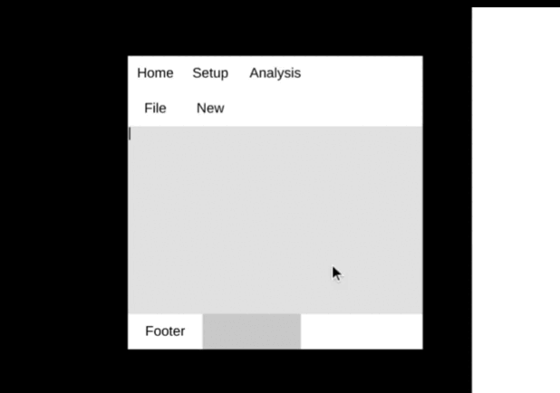

[Previous](./ui.md)
--------------------------------

### Utility js defines colors and some utility methods

#### Colors

```js

    utility_colors.red = color(244,67,54);
    utility_colors.pink = color(233,30,99);
    utility_colors.purple = color(156,39,176);
    utility_colors.deep_purple = color(103,53,183);
    utility_colors.indogo = color(63,81,181);
    utility_colors.blue = color(33,150,243);
    utility_colors.light_blue = color(135,206,235);
    utility_colors.cyan = color(0,188,212);
    utility_colors.aqua = color(0,255,255);
    utility_colors.teal = color(0,150,136);
    utility_colors.green = color(76,175,80);
    utility_colors.light_green = color(139,195,74);
    utility_colors.lime = color(205,220,57);
    utility_colors.sand = color(253,245,230);
    utility_colors.khaki = color(240,230,140);
    utility_colors.yellow = color(255,235,59);
    utility_colors.amber = color(255,193,7);
    utility_colors.orange = color(255,152,0);
    utility_colors.deep_orange = color(255,87,34);
    utility_colors.blur_gray = color(96,125,139);
    utility_colors.brown = color(121,85,72);
    utility_colors.light_gray = color(241,241,241);
    utility_colors.gray = color(158,158,158);
    utility_colors.dark_gray = color(97,97,97);
    utility_colors.pale_ed = color(255,221,221);
    utility_colors.pale_yellow = color(255,255,204);
    utility_colors.pale_green = color(221,255,221);
    utility_colors.pale_green = color(221,255,255);
    
```


#### utility_text(key,text) --  returns updated text on the basis of key provided

Note: key is either current_key_pressed, or current_key_released 

1) In this example, a function is appended to key_released_events too make sure it is called every time key is released and updates the text.



```js

let a = {};
let path = "./docs/media/images/ui_2.png";

function setup(){
  createCanvas(400,400);
  frameRate(120);


  let p = loadImage(path);

  a.a = new ContainerUi("hortz",null,"parent",[300,300]);
  // a.a.state.fill_color = color(255);
  a.a.set_window_pos(50,50);
  a.a.state.fill_color = color(225);

  a.a1 = new GridUi(a.a,"grid",4);
  a.a1.set_row_constant(0,false);
  a.a1.set_row_constant(1,false);
  a.a1.set_row_constant(3,false);
  a.a1.make_row_expanded(2);

  a.Home = new BoxUi(a.a1.get_row(0),"Home");
  a.Home.set_text("Home");
  a.Home.body.set_focus_clicked_event(()=>{
    console.log("Gekki")
  });
  a.Setup = new BoxUi(a.a1.get_row(0),"Setup");
  a.Setup.set_text("Setup");
  a.Analysis = new BoxUi(a.a1.get_row(0),"Analysis",60);
  a.Analysis.set_text("Analysis");
  a.s1 = new ExpandedUi(a.a1.get_row(0),"s1");

  a.File = new BoxUi(a.a1.get_row(1),"File");
  a.File.set_text("File");
  a.New = new BoxUi(a.a1.get_row(1),"New");
  a.New.set_text("New");
  a.s2 = new ExpandedUi(a.a1.get_row(1),"s2");

  //  testing to see if removing works as expected
  // a.File.remove(); 
  // a.a1.add_child(1,a.File.bg,1);

  a.TextArea = new ExpandedUi(a.a1.get_row(2),"TextArea");
  a.TextArea.element.state.fill_color = color(225);
  a.TextArea.element.set_text_params([LEFT,TOP],null,WORD);
  a.TextArea.element.set_text("|");
  let b1 = false;
  key_released_events.push(()=>{
    if(!b1) return;
    let p1 = current_key_released;
    a.TextArea.element.set_text(utility_text(p1,a.TextArea.element.text));
  })
  a.TextArea.element.set_focus_event(()=>{
    b1  = true;
  })
  a.TextArea.element.set_focus_out_event(()=>{
    b1 = false;
  })


  a.Footer = new BoxUi(a.a1.get_row(3),"Footer",60);
  a.Footer.set_text("Footer");
  a.slider = new SliderUi(a.a1.get_row(3),"Slider","hortz",100,20);
  a.s3 = new ExpandedUi(a.a1.get_row(3),"s3");
  a.a.compute_box();
  a.slider.slider.set_size(a.slider.slider.w,a.slider.parent.h);
  a.a.compute_box();


  assert(a);
}

function draw(){
  background(0);
  a.a.draw();

  // console.log(current_key_pressed,keyp,is_key_released);

}


```

---------------------------------------
[Next](./examples.md)
-----------------------------